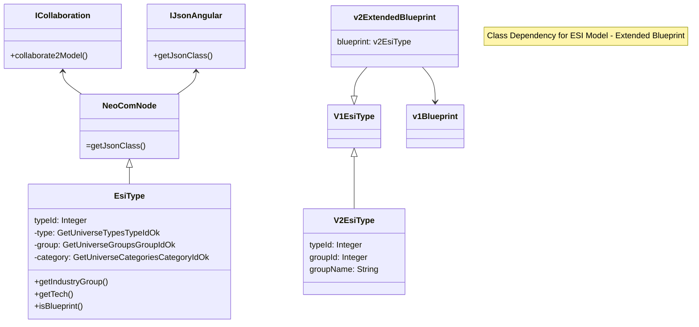

# NeoCom - DataManagement

NeoCom project library that comes from the old Models
package but that includes much more functionaly than
the model definitions for the Eve Online NeoCom application.
If now defines the pure java code for all the repositories,
caches and managers that do not have an specific Android
implementation serving as a code base for generic platform
development. The architecture model has also changed to
a better singleton/static implementation that reduces
dependencies and allows separate use of the modules.

Still there should be some initialization/configuration
code to connect the new library to the runtime implementation
provided by the Application.

# Library Operational Description

## 1. Model Dependencies

The data comes from the ESI Data Services in a detailed set of unrelated data that later on the
neocom processing is going to be extenden and enhanced to serve different purposes.

Starting with the initial set of ESI data that are the Category, Group, Item, Region,
Constellation, System, Station, Structure, Asset Blueprint and MarketData we need to extend the models in the way that
in some moment we need additional structures like a Item that has quantity but is not an Asset, or
a Item that has a price tagged or many other combinations.

The next diagram will show the current proposed model that starts from the need of Extended Blueprint
that should be cached and available on Java platform and also on the Typescript platform.

### Items & Assets

* *EsiType* - This is the map from the ESI item with the addition of the Category and Group data that are other data sources integrated now into EsiType.
* *V1Stack* - When a item has a quantity of identical items packed into a single element we call it a Stack.
* *V1Asset* - When a stack is located in some place. Adding a location adds another dimension to the item.
* *V1Blueprint* - If the item is a Blueprint it will behave differently. On game blueprint are not stackable but we can pack identical blueprint to simplify data management.
* *V2ExtendedBlueprint* - Contains additional data like the product you get when used the blueprint for manufacturing or the estimated vakue and manufacture costs to get a relative comparison index between blueprints and blueprint locations.
* *Resource* - This is deprecated since is equivalent to a Stack.
* *PricedResource* - When a Stack that is located on someplace has a MarketData evaluation and thus has an estimated value.



## 2. Redis Cache Management

Data on the Redis persistence instance should be serialized and timed. So it will behave as a real
cache and items stored on it will be expired. This functionality is not provided by Redes out of
the box so I have to provision some timing registration.

Since the data to be stored is a string data because the deserialization should be possible on
the Typescript platform we can generalize the Redis data store to use generic pada storeage.

Inside the Redis repository there are some sets of Maps. maps allow to contain inside a single key a set of data
indexed by the map key. Then we have two keys. The Redis record key and the map key.

Redis set of keys is defined as follows:

* EBM - Enhanced Blueprint Map. This key has a second parameter that is the **pilot** identifier. There is a key for each pilot with all the EBs for that pilot.
* LOC - The cache for all found and accessed locations.
* TYP - The cache for all ESI item definitions. This should reduce access to ESI Data Source because this data is never changed.

### EBM

The EMB structure will store Extended Blueprints. One Extended Bluprint will have additional
data about the blueprint, the possible output of the blueprint manufacture job
and default market data records to do a comparative index profit evaluation.

Data on this Map is expired so frontend accesses will get a correct list of blueprints and old
blueprints moved or used will no longer be available on this list. Expiration is done on EB instance
and not on the whole set of blueprints.

The *BlueprintProcessorJob* will feed data into this Map scanning all the pilot available
blueprints and packing and adding the additional data already commented. The data will then be
available to the front end over the Typescript new backend service that will collect all or partial
Map data to be sent to the frontend on request. At this point is where cache expiration rules should
be applied.

```mermaid
requirementDiagram
    element V2ExtendedBlueprint {
        type: instance
        docRef: region:100000:BPID:17464:600000645
    }

    element CacheMetadata {
        type: metadata
        docRef: "<timestamp>"
    }
    element EBMElement {
        type: Redis Element
        docRef: "<metadata>:<instance>"
    }

    EBMElement - contains -> CacheMetadata
    EBMElement - contains -> V2ExtendedBlueprint
```

One EBM instance will then have a blueprint instance but for a blueprint pack (the **typeId** of the
blueprint) and a secondary key for the **region** where that blueprint is located. The region
key is added because identical blueprints located on different regions will use different
MarketData sources and then can have a different profit ratio.

EBM MarketData is referenced to the corresponding Region Market Hub that is a predefined list of
stations.

## LOCATIONS

Eve Online locations are a quite complex game element. Many things
can become a location at some point on the game time. And assets
never stop from changing locations and sometimes in massive quantities.

So there should be a easy way to describe location on the NeoCom model
so the development can deal with such complex interpretation.

There are different types of locations:

* **Space K** locations. The will describe space coordinates from the
  Region-Constellation-System game data elements. Any game asset should be
  located at some point on the K space or W space or T space.
* **Space W** locations. The same spatial considerations but for the workmhole
  space systems.
* **Space T** locations. The same as above but for the special triglavian
  space locations we can found on the game.
* **Structure locations**. While on any of the previous spaces we can sit inside
  a game or corporation space structure. Structure locations can be be
  of many types, game, customs, pockets, stations, structures, deployables...
  Some of the structures can aso have different internal hangars, specialized
  for some types of assets or differentiated for easy asset classification
  like the corporation hangars.

### Containabillity

Some game assets are able to 'contain' other assets. Space containers,
hangars, ships... are examples of such capsuleer assets that can be contained
inside another asset. This is describen on the game data on a single field
that sometimes has the meaning of a space location, other times the structure
location (that can be seen as a container) and some other times as a container
unique asset id reference. This makes quite difficult to track asset
containability hierarchy from the top level space location object to the
lower level asset container.

There can be a container hierarchy for a single asset. The deepest case is
for:

* asset located into a space container.
* space container located into a ship hangar
* ship hangar located on a ship.
* ship inside an special ship hangar on ship transportations
* special ship hangar on ship transportation
* ship transportation docked on station ship hangar
* station ship hangar on station
* station on system
* system on constellation
* constellation on region

### Location coordinates

We can set then a group of coordinates to describe the asset location.

* **Space K**. The space K coordinate system has 3 integer values. One for the
  Region (coordinate on the 10M range ), a second for the Constellation
  ( on the 20M range) and a third for the System ( on the 30M range). There
  is a set of data tables that define which system is on a constellation
  and which constellation is on a region. On the game space there should not be
  a space coordinate less than the 30M range because assets should be located on
  a system.
* **Space W**. I do not know much about W space but wormhome space is built from
  disconnected systems. There are no constellations not regions. The can be
  identified by a single system identifier.
* **Structures**. With the deploy of citadel expansion now there are thousands of
  corporation structures available for docking. So each asset not directly located floating
  on empty space should be inside a structure.
  Original game structures have a identifier range below 61M. This locations can
  be searched on a game structure database and will not change over time.
  Identifiers above 61M point to other assets as containers that will also include
  corporation proprietary structures among other asset types.

[LOCATION IDENTIFIER GENERATION]
The location identifier is obtained form the game asset information. It starts
with 3 fields:

* **location id**. The unique identifier of the location. Below 61M can be a game
  station. Over 61M can be different solutions.
* **location flag**. Encoded value to select the hold, slot or other when the asset is
  located. Mostly related to ships locations.
* **location type**. Only differentiates from syste, station or other.

With this information we can clearly pinpoint any game station asset.

But assets that have the location id above 61M need a dedicated special
processing to identify the real location. From the previsous definitions we
can consider that for such cases the location is now an asset identifier.
By locating the asset we can identify the next step on the container chain.

### Location Identifier elements

* **Space identifier**. The identifier below 40M for the
  system-constellation-region.
* **Station identifier**. The game station is below 61M or the asset id
  for a corporation structure.
* **Parent Container**. Asset identifier for the asset container.

### Space locations

Space locations have a discontinuity because usually contain stations
that may or may not be corporation assets. But at the same time the pilot
can leave assets on space so their contents have to support stations
and assets at the same time.

## Asset Processing

### Asset Preparation

The asset classification system expects that that asset knows its location
. This information is something we can get when converting the asset
from the esi form to the persistence repository form.

When processing an esi asset we know about the identifier of the
location. If the values is below 61M then it is a game structure
but ig greater then we face two options.

If the identifier value is on the list of the character assets
or the corporation assets then we can know the pointer parent
asset and know it it is a corporation structure or a container.

But if the identifier is not known we can not get any other information
from the ESI service and we should consider the location as
UNKNOWN.

The list of unknown locations can be reduced by searching other
game data repositories that may show the list of citadels and
structures belonging to other corporations. This should reduce
the list to only new structures still not registered or the
customs offices and other old game structures that are not
registered elsewere.

### Asset Processing

So when we process the assets for rendering we know the exact
type of the location hat was calculated when the asset was
persisted. With that information then asset classification
is much more easy since every asset has the identifiers
pointing to the first level location (up to the structure level)
and the low level pointing to the parent container.

There should be then two lists of containers. Space locations
for space and structure items and container locations to be aggregated
and that will conform a container hierarchy up to the asset at
the first level.

Because a character does not own the structures it should
relay the search to a new public game structure service available
on the ESI service but on the authenticated side.

If the location is not found on this list or on the asset list
then it should be considered on UNKNOWN space location.

The problem to search for the corporation public structures
is that the endpoint requires authentication. The normal search
is not valid because the Location Catalog has not access to
credential data. This action should be done outside and then
used the registration mechanism to cache the obtained data.

### Location Caching mechanics

Generated locations should be single instances that can be
reused everywhere. There should be a single copy of a location
on the application. But there can be multiple references to it
from many asset containers.

## Scheduler

### When register jobs to the scheduler

This is the key question because the scheduler will check every minute
the actions to execute from the list of registered jobs. But
the job registration should not be executed every minute because
the jobs are valid with a single registration.

For components this is simple since the registration
can be done when the component is initialized. But for
Credential update action that are repetitive the registration
is not so clear.
Probably the right place is an initialization task that
will run the list of Credentials and generate the jobs
registrations.

### Job instance duplication

Jobs can be created from a base clas and do almost anything so their
have many different internal unique identifiers. Because there is
no enought data on the base class to create such differentiation
I have to search for a pattern to create unique enough job identification
so to detect when at job registration there a exact job already
registered.

Jobs start from the Job class and have their own classname. Apart
from that information there no other coincidences or fields that can
be used to differentiate jobs. So the only element left for that
duplicate detection is only the job object instance itself.
